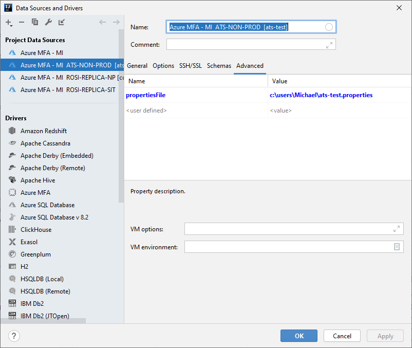
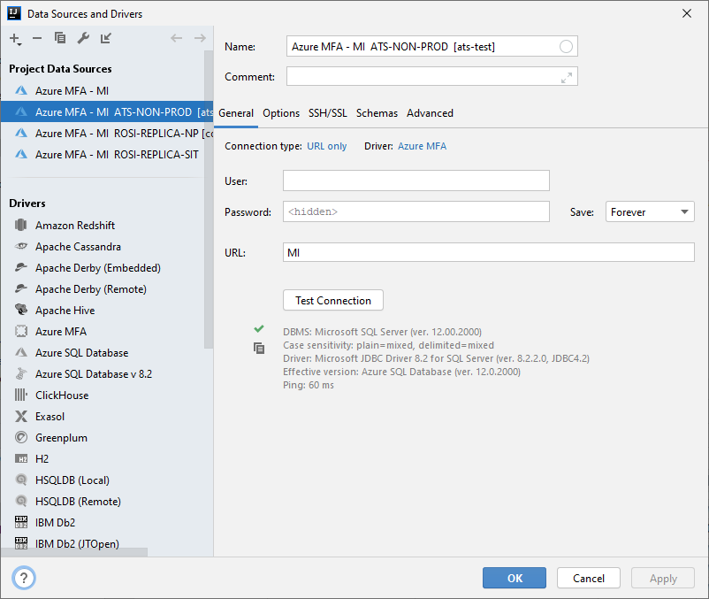

# Device Code Flow to Login to Azure SQL Database using an identity with MFA


# Architecture

The current SQL Server drivers support an authentication mode where they can be passed an oauth token instead of a 
username/password to authenticate a user.

But the acquisition of such tokens is left to the application developer.  This project provides the necessary code to 
enable token acquistion and allow the database to be logged into even with users that have Multifactor 
authentication (MFA) enabled.

The code here is used to setup the device code flow against an app registration made in Azure Active Directory with 
user_impersonation enabled.

When a user authenticates in this way it is possible to aquire a token in the name of the user that authenticated to
then access the database with.

The primary purpose of this library is to allow developers with MFA enabled Active Directory Accounts to access the 
database as themselves.

However, its also possible to use the confidential client flow to login as the app registration identity directly.  

# Active Directory App Registration Configuration

## User Impersonation API Permissions


## Device Code Flow


A redirect url of http://localhost needs to be added and selected as well.

# Intellij Custom Driver Configuration

Build this project (./gradlew clean build shadowJar) then point intellij at the location of the shadow.jar.
Change the driver class to **device.code.sql.server.driver.DeviceCodeDriver**


# Intellij Custom Datasource Configuration
 
Change connection type to **URL Only**.  This code doesn't use the url in any way.  Everything comes in via options in the **Advanced Tabs**.  Once configured pressing the **Test** button will validate the connection.


## Device Code Flow Settings

The **hostNameInCertificate** as given here is incorrect.  Note the uppercase **N** in hostName.

 Name | Value 
 --- | ---
 tenantId | The tenantId of the Active Directory Tenant where the app registration is registered.
 clientId | The clientId of the app registration
 database | The name of the database
 server | The name of the server
 hostNameInCertificate | hostname to validate in the certificate.
 clientSecret | If specified confidential client flow is used.
 propertiesFile | Absolute path to properties file to define the above properties.  Any entry here will override this properties file.


## Device Code Flow Settings File

I've found passing the values through the advanced tab quite unreliable.  The best way seems to be to define a properties file and then
have a single **propertiesFile** entry they points to the absolute path of the properties file.

The code is written so that you can override any setting in the properties file using the advanced tab.



The configuration can be tested on the Datasource **General** tab by pressing the **Test Connection** button..

If it works then you will see something like this.  If not check the logfile to see what failed.


# Example Login Flow

[](http://www.youtube.com/watch?v=zwT9GFyvsy8 "Device Code Login Flow with SQL Server driver in Intellij")


I'm not an SQL Server expert and so my test user doesn't have the correct rights in SQL server
But you can see from the video how it works and that you are able to connect as the user
to the database.

# Preconfiguring using a properties file

DB-X-preconfigured.properties:

```
tenantId=
clientId=
database=
server=
hostNameInCertificate=
clientSecret=
```

If the clientSecret is provided then the client confidential token acquisition method will be used.

If the clientSecret is absent then the device code flow will be used to acquire a token in the name of the user that logs in instead of the app registration identity itself.


# Debugging

A log file **device-code-sql-server-driver.log** is emitted in the users home directory.
