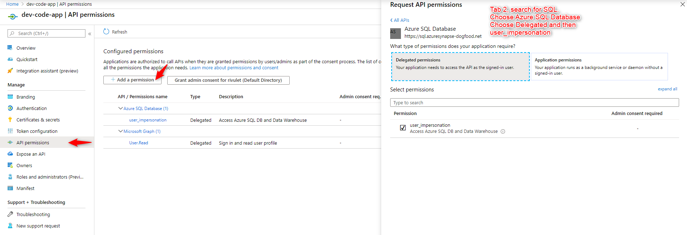
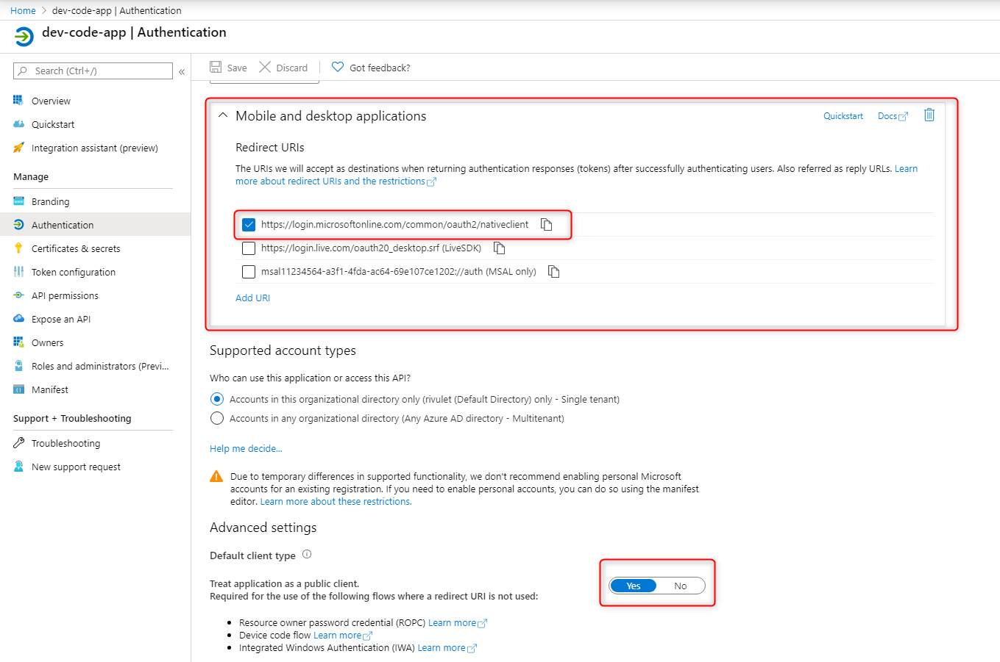
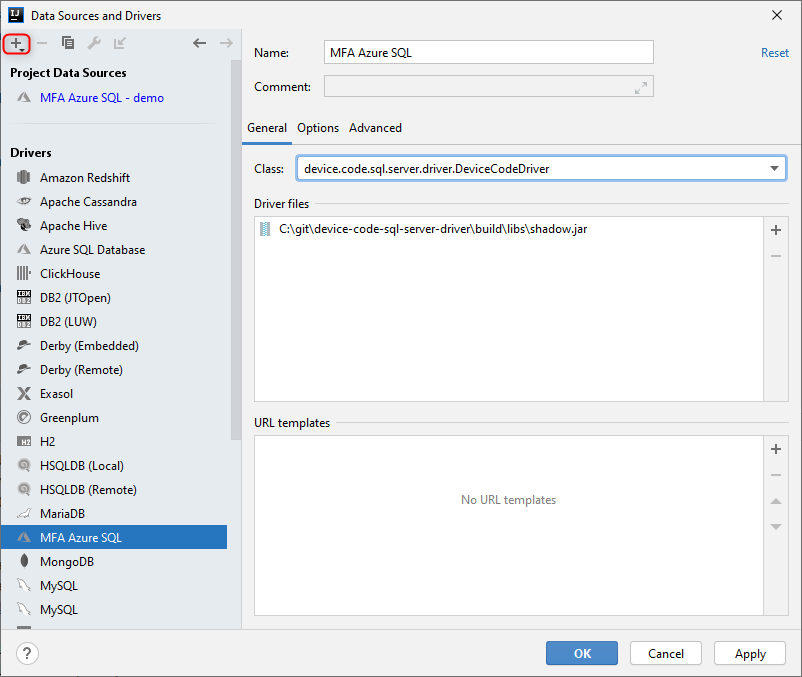
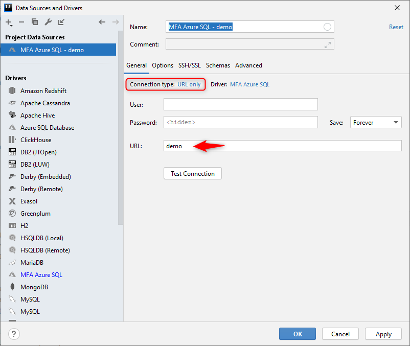
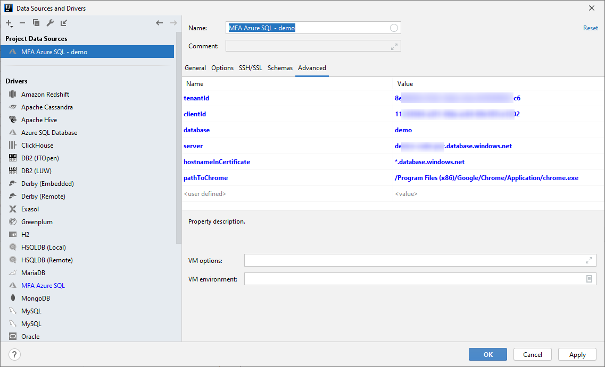

# Device Code Flow to Login to Azure SQL Database using an identity with MFA

# Architecture

The current SQL Server drivers support an authentication mode where they are passed an oauth token instead of a 
username/password.

But the aquisition of such tokens is left to the appliation developer.  This project provides the necessary code to 
enable token acquistion and allow the database to be logged into even with users that have Multifactor 
authentication (MFA) enabled.

The code here is used to setup the device code flow against an app registration made in Azure Active Directory with 
user_impersonation enabled.

When a user authenticates in this way it is possible to aquire a token in the name of the user that authenticated to
then access the database with.

The primary purpose of this library is to allow developers with MFA enabled Active Directory Accounts to access the 
database as themselves.

However, its also possible to use the confidential client flow to login as the app registration identity directly.  

# Active Directory App Registration Configuration

## User Impersonation API Permissions

## Device Code Flow

# Intellij Custom Driver Configuration

Build this project then point intellij at the location of the shadow.jar

# Intellij Custom Datasource Configuration
 
Change connection type to **URL Only**.  This code doesn't use the url in any way.  Everything comes in via options in the **Advanced Tabs**

## Device Code Flow Settings

# Example Login Flow

[Example Login Flow Video](example-login-flow.mp4)

I'm not an SQL Server expert and so my test user doesn't have the correct rights in SQL server
But you can see from the video how it works and that you are able to connect as the user
to the database.
